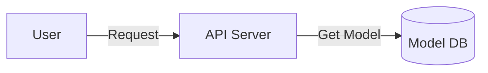

# Model DB
Implementation of Database and Rest API Service for managing models and experiments

## Build and Deploy
```sh
# Docker Build
$ make build

# Docker Compose Up
$ make c_up

$ curl -X 'GET' 'http://localhost:8000/v0.1/api/projects/all' -H 'accept: application/json'

# Service Down
$ make c_down
```

## Test
Open `localhost:8000/docs` in your browser to check that the Swagger is running

## FlowChart
